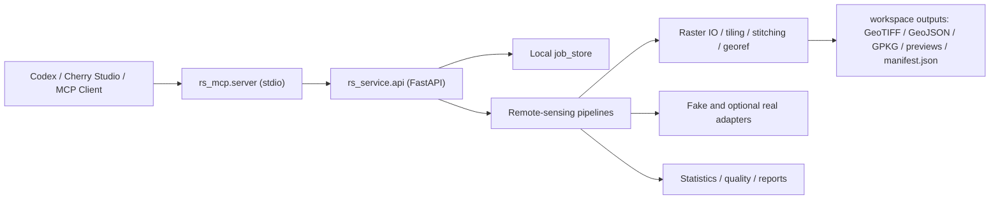

# rs-mcp-agent

`rs-mcp-agent` is a remote-sensing MCP project with a FastAPI backend and a stdio MCP server. It is designed to let Codex, Cherry Studio, and other MCP clients inspect GeoTIFFs, run tiled geospatial inference, calculate spectral indices, analyze outputs, run quality checks, and generate rule-based reports.

Large model weights are not committed. The default path uses fake adapters so the whole project can run without GPU or heavyweight ML packages.

## Architecture



## Supported Tasks

- Raster inspection and tiling preflight
- Object detection
- Oriented object detection
- Semantic segmentation
- Instance segmentation
- Bi-temporal change detection
- Super-resolution
- Spectral indices: NDVI, NDWI, MNDWI, NDBI, SAVI, EVI
- Statistics, quality checks, and Markdown reports

## Fake Mode vs Real Model Mode

Fake mode is the default. It uses numpy/Pillow logic to produce deterministic outputs for development, testing, demos, and MCP integration.

Real model mode is optional and lazy-loaded. Supported adapter skeletons include:

- Ultralytics YOLO and SAHI
- MMSegmentation
- MMDetection
- MMRotate
- Open-CD
- SwinIR
- BasicSR
- MMagic placeholder

If a real backend dependency or checkpoint is missing, only that selected job fails with a clear error. FastAPI, MCP, and fake pipelines still start.

## Quick Start

```bash
python -m venv .venv
.venv\Scripts\activate
pip install -e ".[dev]"
make dev-check
make synthetic
make smoke
```

If `make` is unavailable:

```bash
python scripts/dev_check.py
python scripts/create_synthetic_geotiff.py --output workspace/synthetic.tif
python scripts/smoke_test.py
```

Start FastAPI:

```bash
make api
```

Start MCP:

```bash
make mcp
```

More detail: [docs/quickstart.md](docs/quickstart.md).

## MCP Tools

- `inspect_raster`
- `preflight_plan`
- `list_models`
- `run_object_detection`
- `run_oriented_detection`
- `run_semantic_segmentation`
- `run_instance_segmentation`
- `run_change_detection`
- `run_super_resolution`
- `run_spectral_indices`
- `calculate_statistics`
- `quality_check_result`
- `generate_report`
- `get_job_status`
- `get_result_manifest`

Tool details: [docs/mcp_tools.md](docs/mcp_tools.md).

## Model Registration

Models are registered in `configs/models.yaml` and mirrored by the lightweight registry in `rs_service/registry.py`.

Example:

```yaml
- id: mmseg_segformer_landcover
  task: semantic_segmentation
  backend: mmseg
  framework: mmsegmentation
  config: external/mmsegmentation/configs/segformer/segformer_landcover.py
  checkpoint: weights/mmseg_segformer_landcover.pth
  device: cpu
```

Do not commit large weights. Use `weights/`, `workspace/models/`, or absolute paths.

## Outputs

Every pipeline writes a `manifest.json` containing:

- `job_id`
- `task`
- `status`
- `model_id`
- `input_files`
- `parameters`
- `outputs`
- `statistics`
- `metrics`
- `quality_flags`
- `conclusion`
- `errors`

Typical outputs include GeoTIFF, GeoJSON, GPKG, PNG previews, `stats.json`, `quality.json`, and `report.md`.

## Developer Commands

```bash
make install
make test
make unittest
make lint-basic
make dev-check
make smoke
make synthetic
make api
make mcp
make clean-workspace
```

## Safety Notes

- MCP stdio stdout must only contain MCP protocol messages.
- Ordinary logs should go to stderr or files.
- Real model weights are local files and are never downloaded by default.
- Conclusions are rule-based and must come from manifest statistics and quality flags.
- No-reference super-resolution does not report PSNR/SSIM.
- Change detection reports alignment warnings when CRS, transform, resolution, bounds, or shape differ.

## More Docs

- [API](docs/api.md)
- [Quickstart](docs/quickstart.md)
- [Troubleshooting](docs/troubleshooting.md)
- [Codex MCP config](docs/codex_mcp.md)
- [Cherry Studio MCP config](docs/cherry_studio_mcp.md)
- [Model weights](docs/model_weights.md)
- [Detection install](docs/install_detection.md)
- [Segmentation install](docs/install_segmentation.md)
- [OpenMMLab install](docs/install_openmmlab.md)
- [Change detection install](docs/install_change_detection.md)
- [Super-resolution install](docs/install_super_resolution.md)
